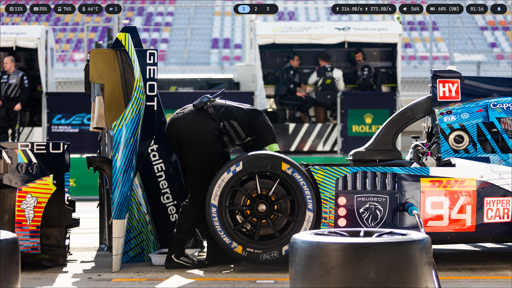

<div align="center">
  <h1 align="center">Simple Arch Ricing 🐧✨</h1>
  <p align="center">
    <strong>It's not bloated, I swear. Just clean configs for my sanity.</strong><br>
    My personal Arch Linux + Hyprland setup. Works on my machine, good luck on yours.
  </p>

  <p align="center">
    
    
    
    
  </p>
</div>

---

## 🖼️ Look at Me



---

## 🧐 What is this?

This is my collection of dotfiles. It's the result of spending way too many hours editing text files to make my computer look like a hacker movie (but with better colors).

It's built around **Hyprland** and uses **Matugen** to generate colorschemes from my wallpaper. Yes, the whole system changes color when I change the wallpaper. It's excessive, but I love it.

**Is it bloated?**
No. (Maybe a little. But the good kind of bloat).

---

## 🛠️ The Arsenal (Tech Stack)

* **Window Manager:** [Hyprland](https://hyprland.org/) (Because animations go *brrr*)
* **Bar:** [Waybar](https://github.com/Alexays/Waybar) (Clean, minimal, shows what I need)
* **Launcher:** [Rofi](https://github.com/davatorium/rofi) (With a custom theme that actually matches)
* **Notification:** [SwayNC](https://github.com/ErikReider/SwayNotificationCenter) (Control center included)
* **Terminal:** [Kitty](https://sw.kovidgoyal.net/kitty/) (GPU accelerated, because text needs to be fast?)
* **Shell:** Zsh + [Starship](https://starship.rs/) (Make the prompt look expensive)
* **Color Generator:** [Matugen](https://github.com/InioX/matugen) (The MVP of this setup)
* **Editor:** Neovim (For feeling cool) & VSCode (For actual work)

---

## 🎨 Features

* **Material You Implementation:**
  Change the wallpaper, and **everything** changes. Waybar, Rofi, Borders, Terminal colors, VSCode... it all syncs up. It's magic.
* **Clean aesthetic:**
  Gaps? Checked. Blur? Checked. Rounded corners? You bet.
* **Actually usable:**
  I code on this daily (Laravel, Python, React). It's not just for screenshots.

---

## 🚀 How to Steal This (Installation)

**⚠️ WARNING:**
Don't just copy-paste my entire config if you don't know what you're doing. You might break something, and I can't fix your computer over the internet.

**1. The "I want to cherry-pick" method (Recommended):**
Clone the repo and copy the parts you like.

```bash
git clone [https://github.com/YOUR_USERNAME/YOUR_REPO_NAME.git](https://github.com/YOUR_USERNAME/YOUR_REPO_NAME.git)
cd YOUR_REPO_NAME
# Copy what you need, e.g., Hyprland config
cp -r .config/hypr ~/.config/
```

**2. The "YOLO" method (Not Recommended):**
Copy everything and pray.

```bash
# Backup your old configs first!
cp -r .config/* ~/.config/
```

*(You probably need to install the dependencies listed in `The Arsenal` section first. Use `pacman` or `yay`, don't be a savage.)*

---

## ⌨️ Keybinds Cheat Sheet (For my future self)

* `Super + T`: Open Terminal (Kitty)
* `Super + Q`: Close Window (Bye bye)
* `Super + E`: File Manager
* `Super + Space`: App Launcher (Rofi)
* `Super + X`: Power Menu (Shutdown, Reboot, Touch Grass)
* `Super + N`: Notification Center

---

## 🤝 Credits

* **Hyprland Community:** For the endless inspiration.
* **Matugen:** For making color theming stupidly easy.
* **Coffee:** For fueling the late-night debugging sessions.

---
<div align="center">
  <i>"It works on my machine." - Every Developer Ever</i>
</div>
